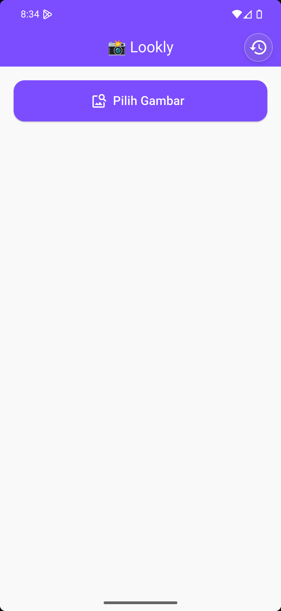
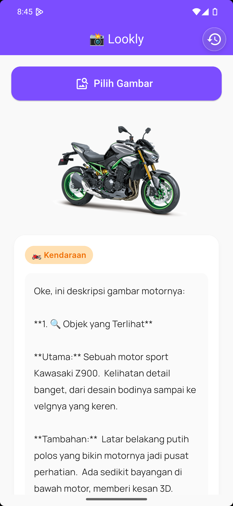
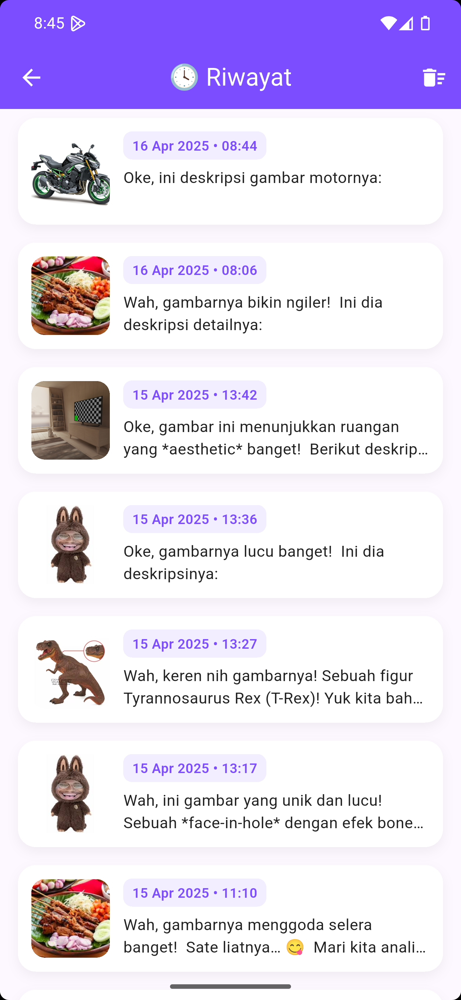
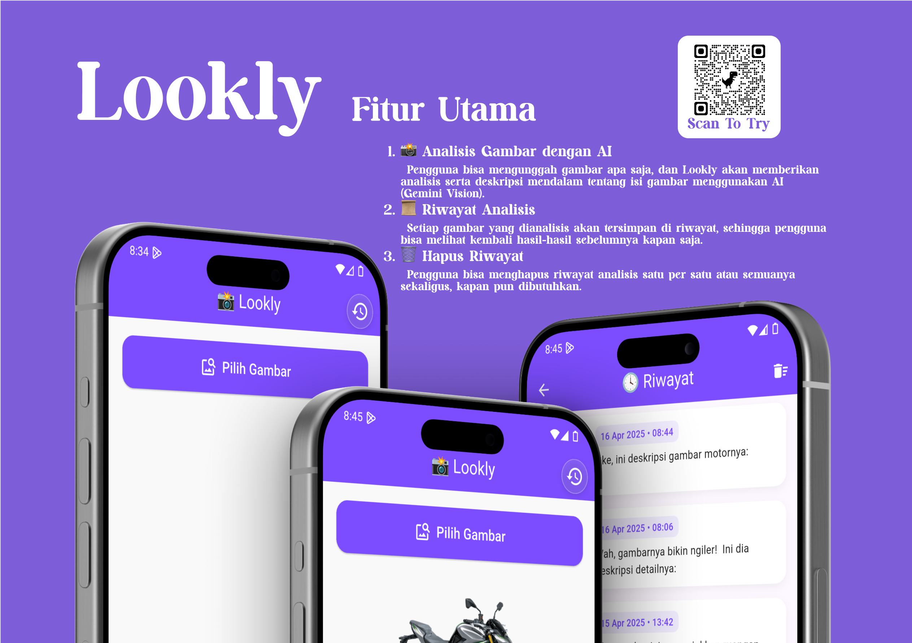

# 🌟 Lookly: Your Image-Based Analysis & History App 📸

Welcome to *Lookly* 🎉, an app that analyzes any image and lets you track your past analysis with ease! 🚀 Upload images, get detailed insights, and manage your history all in one place. 🧠📸✨

## 🛒 What's Inside?

**📸 Image Analysis:** Upload a picture, and *Lookly* will provide a detailed description and analysis of the image.  
**📜 History:** View and track your past image analysis easily.  
**🗑️ Delete History:** You can delete your history whenever you like.

## 🎯 Why This App?

Images speak for themselves, but *Lookly* takes it a step further by giving you deep insights into each image. Whether you're exploring new objects, animals, scenes, or other types of images, *Lookly* makes it simple and fun! 🌟📊

## 📸 Screenshots

Here’s a sneak peek at what you can expect from *Lookly*:

| **Home Screen** | **Analysis Result** | **History Screen** |
|--------------------|-----------------------|-----------------------|
|  |  |  |

## 🖼️ Additional File

Below is an A4-sized landscape image related to *Lookly*:

## 🚀 Features

- **📸 Image-Based Analysis:** Upload images to get detailed analysis using AI.
- **📜 History:** Keep track of all your past image analyses.
- **🗑️ History Deletion:** Easily delete your history at any time.

## 🛠️ Built With

This app is built using **Flutter**, ensuring a seamless user experience across both iOS and Android platforms. 🖥️📱

## 🎨 Splash Screen

*Lookly* features a custom splash screen to welcome you and get you started on your image analysis journey! 🌟✨

## 📥 Installation & Usage

### 1. **Install the App**
To install the app, you can download the APK file or build the app yourself.

- **Download APK**: [Download Lookly APK](build/app/outputs/flutter-apk/app-debug.apk)

### 2. **Upload an Image**
Once you’ve opened the app, you can upload an image for analysis by following these steps:
- Tap on the "Upload Image" button.
- Choose an image from your gallery.

### 3. **View Analysis**
After uploading an image, *Lookly* will analyze the image and provide a detailed description of what’s in the image.

### 4. **Check Your History**
To view past analyses, simply navigate to the "History" section in the app.

### 5. **Delete History**
You can delete any analysis from your history by using the "Delete History" button.

---

## 📝 How to Contribute

If you would like to contribute to *Lookly*, feel free to fork the repository and submit a pull request. We welcome any bug fixes or feature suggestions! 🙌

---

## 🤖 AI Integration (Optional)

If you want to enhance the app by integrating an AI image analysis API (like Gemini or other vision models), you can modify the `_analyzeImage()` function in the app’s code to call your desired API and display the results.

---

## 📜 License

This project is licensed under the MIT License - see the [LICENSE](LICENSE) file for details.

---

Feel free to explore the app and let us know if you have any feedback or suggestions. Happy analyzing! 📸💖
